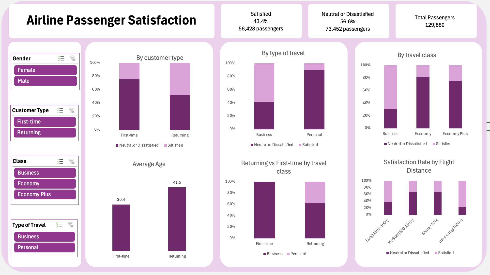

# Airline_Passenger_Satisfaction

Exploratory analysis of customer satisfaction scores from 129,880 airline passengers, covering demographic profiles, travel patterns, and the key factors that drive — or undermine — a positive flight experience.

Airline passenger satisfacion analysis of 129,880 passengers

---

## Dataset

**File:** `airline_passenger_satisfaction.csv`  
**Rows:** 129,880 passengers  
**Columns:** 24

| Column | Description |
|--------|-------------|
| `ID` | Unique passenger identifier |
| `Gender` | Male / Female |
| `Age` | Passenger age |
| `Customer Type` | Returning / First-time |
| `Type of Travel` | Business / Personal |
| `Class` | Business / Economy Plus / Economy |
| `Flight Distance` | Distance in miles |
| `Departure Delay` | Delay in minutes |
| `Arrival Delay` | Delay in minutes |
| `Satisfaction` | Satisfied / Neutral or Dissatisfied |
| *(14 rating factors)* | Scores 1–5 for individual service dimensions |

**Rating factors:** Departure and Arrival Time Convenience, Ease of Online Booking, Check-in Service, Online Boarding, Gate Location, On-board Service, Seat Comfort, Leg Room Service, Cleanliness, Food and Drink, In-flight Service, In-flight Wifi Service, In-flight Entertainment, Baggage Handling.

---

## Key Findings

### 1. Overall satisfaction
Only **43.4%** of passengers are satisfied. The majority (56.6%) are neutral or dissatisfied.

### 2. Satisfaction varies widely by segment

| Segment | Satisfied |
|---------|-----------|
| Returning customers | 47.8% |
| First-time customers | 24.0% |
| Business travel | 58.3% |
| Personal travel | 10.1% |
| Business class | 69.4% |
| Economy Plus | 24.6% |
| Economy | 18.8% |

### 3. Longer flights correlate with higher satisfaction

| Distance | Satisfied |
|----------|-----------|
| Short (<500 mi) | 33.6% |
| Medium (500–1,500 mi) | 33.7% |
| Long (1,500–3,000 mi) | 62.0% |
| Ultra-long (3,000+ mi) | 77.4% |

Satisfied passengers fly an average of **1,530 miles** vs. **930 miles** for dissatisfied passengers. Short-haul passengers likely have more transport alternatives and higher convenience expectations.

### 4. Returning customer profile

Returning passengers skew older (avg. **41.5 years** vs. **30.4** for first-timers), have a more balanced mix of business and personal travel (62% / 38%), and are more likely to fly business class.

> **Data quality note:** 99.2% of first-time passengers in this dataset fly for business, with only 201 of 23,780 flying for personal reasons. This is likely a data collection artifact (e.g. survey distributed via corporate booking platforms) rather than a genuine behavioral pattern, and should be treated with caution in any downstream analysis.

---

## Analysis Questions

The following questions guided the analysis:

1. What percentage of passengers are satisfied? Does it vary by customer type or travel type?
2. What is the profile of a returning passenger?
3. Does flight distance affect customer preferences or satisfaction?
4. Which factors contribute most to satisfaction — and dissatisfaction?

---

## Tools

- **Excel** —  For analysis, visualisation, and PivotTables for KPI replication

---

## Caveats

- Satisfaction is self-reported and binary (satisfied vs. neutral/dissatisfied), which may compress nuance
- The near-absence of personal-travel first-timers (0.8%) suggests potential survey distribution bias

